# dbtest System Architecture

## Overview

The `dbtest` CLI tool provides unified test and benchmark discovery and execution for the data-bridge project, powered by a Rust engine with Python bindings.

## High-Level Architecture

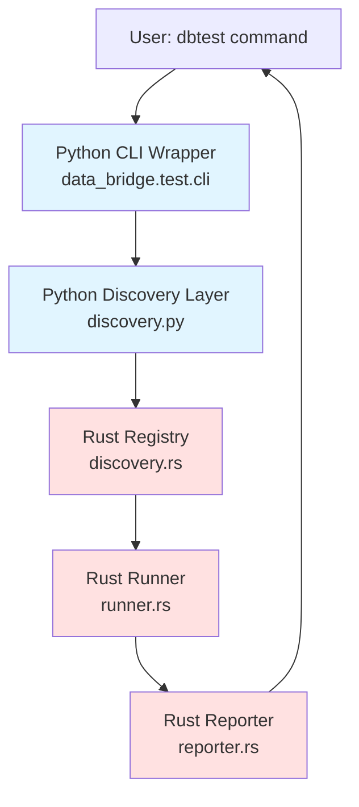

## Detailed Component Architecture

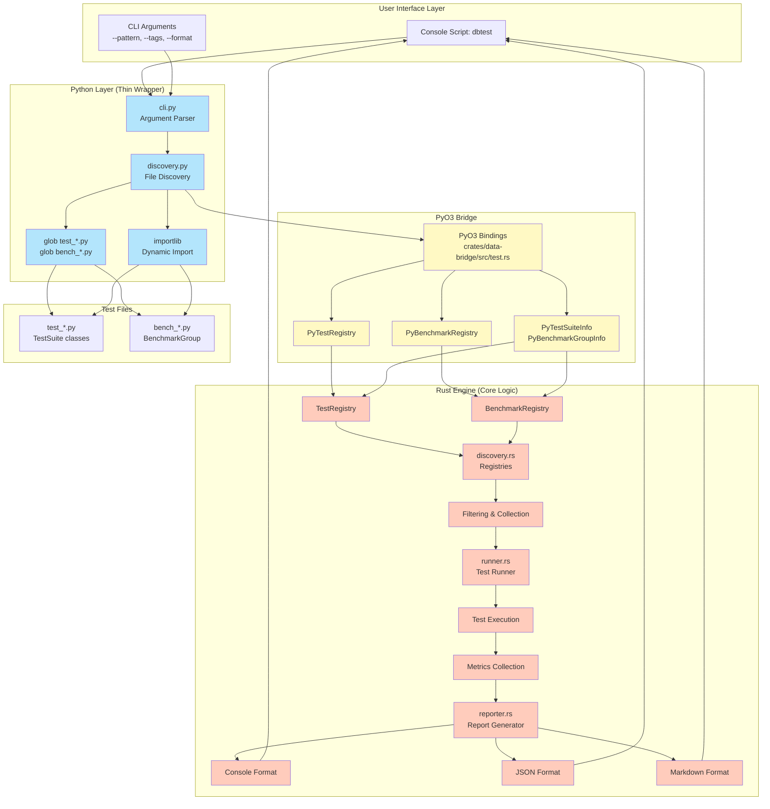

## Data Flow: Test Discovery & Execution

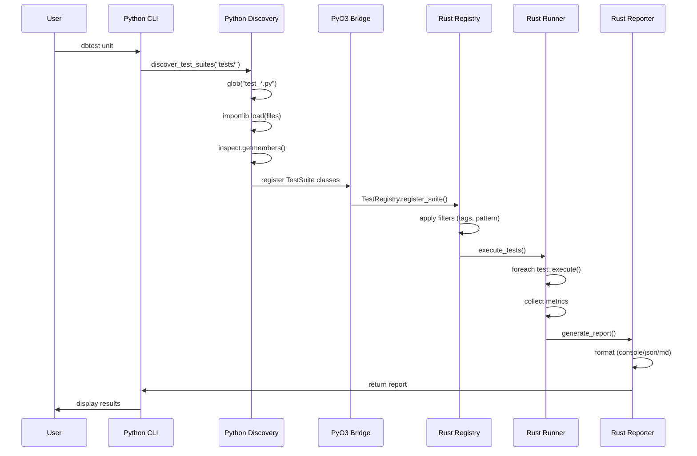

## Data Flow: Benchmark Discovery & Execution

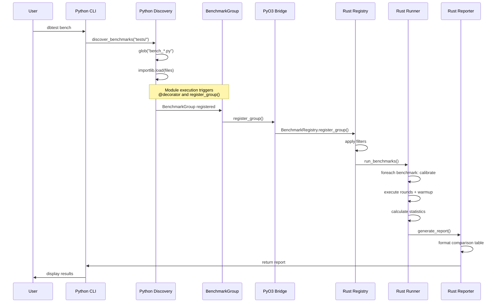

## File Structure

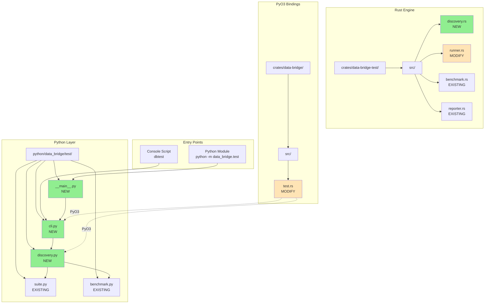

## Component Responsibilities

### Python Layer (Thin Wrapper)

#### 1. CLI (cli.py)
- **Purpose**: Command-line interface and argument parsing
- **Responsibilities**:
  - Parse arguments (--pattern, --tags, --format)
  - Route to appropriate runner (unit/integration/bench)
  - Display results to user
- **Key Functions**:
  - `main()`: Entry point
  - `run_tests_only()`: Execute tests
  - `run_benchmarks_only()`: Execute benchmarks
  - `run_all()`: Execute both

#### 2. Discovery (discovery.py)
- **Purpose**: File system discovery and module loading
- **Responsibilities**:
  - Glob pattern matching (test_*.py, bench_*.py)
  - Dynamic module import via importlib
  - Class/function introspection via inspect
- **Key Functions**:
  - `discover_test_suites()`: Find TestSuite classes
  - `discover_benchmark_files()`: Wrapper for existing discover_benchmarks()

### Rust Layer (Core Engine)

#### 3. Discovery (discovery.rs) - NEW
- **Purpose**: Registry and metadata storage
- **Responsibilities**:
  - Store test/benchmark metadata
  - Filter by tags, patterns, types
  - Provide statistics
- **Key Types**:
  - `TestRegistry`: Test suite registry
  - `BenchmarkRegistry`: Benchmark registry
  - `TestSuiteInfo`: Test suite metadata
  - `BenchmarkGroupInfo`: Benchmark metadata

#### 4. Runner (runner.rs) - EXISTING
- **Purpose**: Test execution orchestration
- **Responsibilities**:
  - Execute tests/benchmarks
  - Collect metrics
  - Handle timeouts and errors
- **Key Types**:
  - `TestRunner`: Main runner
  - `TestResult`: Execution results
  - `TestMeta`: Test metadata

#### 5. Reporter (reporter.rs) - EXISTING
- **Purpose**: Report generation and formatting
- **Responsibilities**:
  - Format results (console/JSON/markdown)
  - Generate comparison tables
  - Save reports to files
- **Key Types**:
  - `Reporter`: Report generator
  - `TestReport`: Aggregated results
  - `BenchmarkReport`: Benchmark results

### PyO3 Bridge

#### 6. PyO3 Bindings (test.rs)
- **Purpose**: Expose Rust types to Python
- **Responsibilities**:
  - Wrap Rust types with #[pyclass]
  - Implement Python methods with #[pymethods]
  - Handle Python ↔ Rust conversions
- **Key Classes**:
  - `PyTestRegistry`
  - `PyBenchmarkRegistry`
  - `PyTestSuiteInfo`
  - `PyBenchmarkGroupInfo`

## Execution Flow

### Unit Test Execution

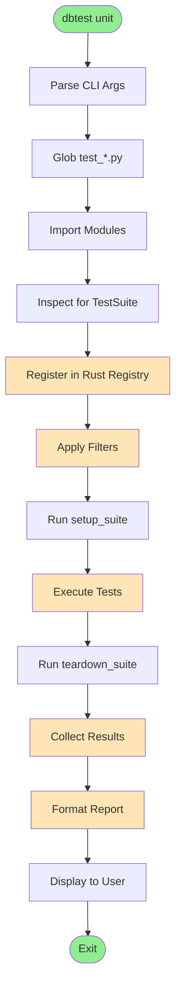

### Benchmark Execution

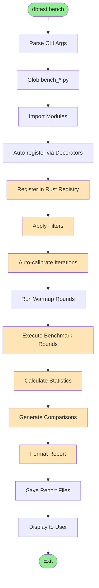

## State Machines

### Discovery State Machine

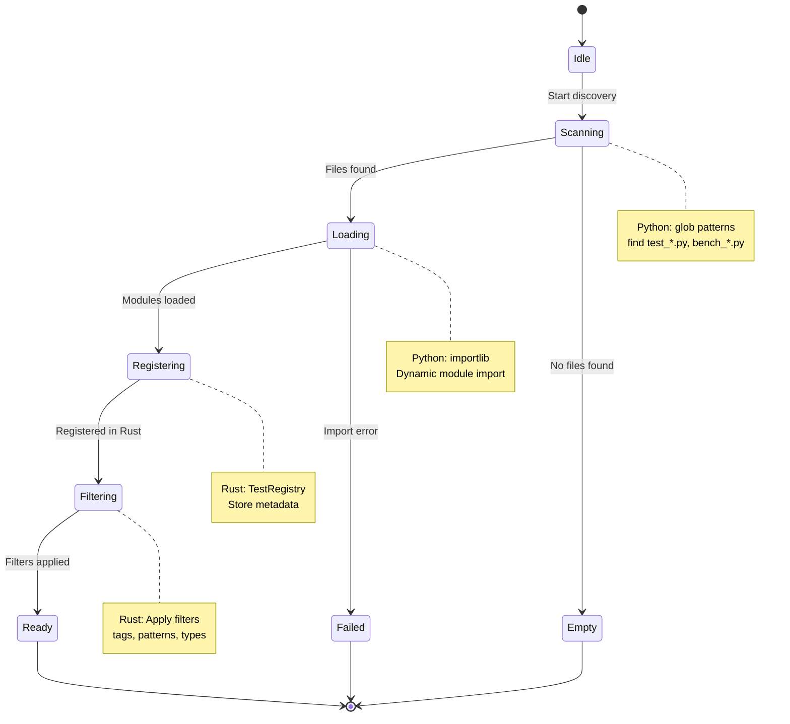

### Test Execution State Machine

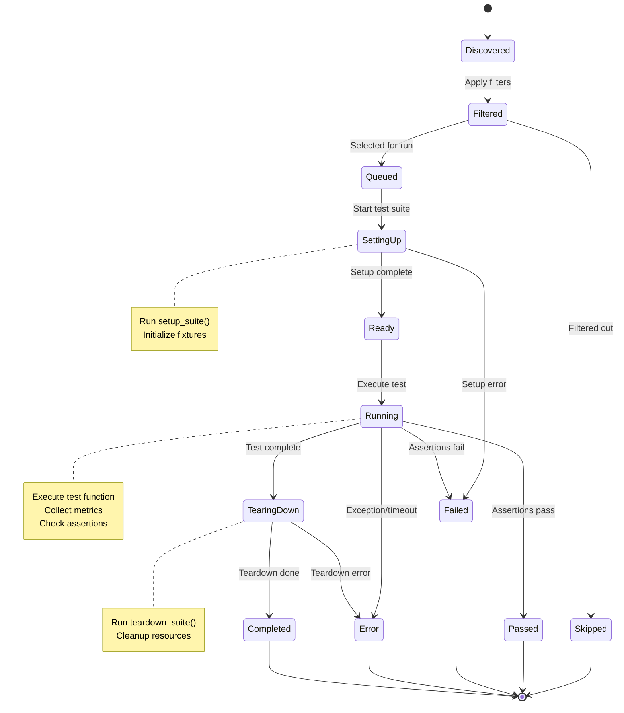

**States:**
- **Discovered**: Test found during discovery
- **Filtered**: After tag/pattern filtering
- **Queued**: Scheduled for execution
- **SettingUp**: Running setup_suite()
- **Ready**: Setup complete, ready to run
- **Running**: Test executing
- **TearingDown**: Running teardown_suite()
- **Completed**: All phases done
- **Passed/Failed/Error/Skipped**: Final states (TestStatus)

### Benchmark Execution State Machine

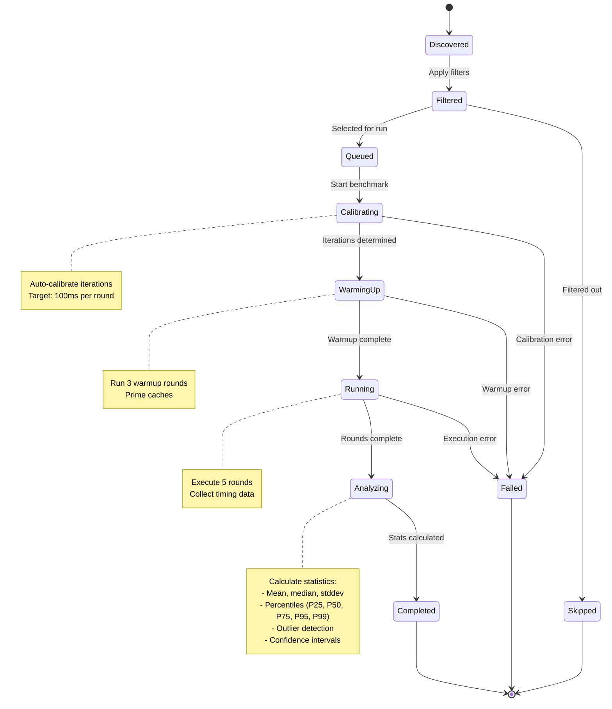

**States:**
- **Discovered**: Benchmark found during discovery
- **Filtered**: After pattern filtering
- **Queued**: Scheduled for execution
- **Calibrating**: Determining iteration count
- **WarmingUp**: Running warmup rounds
- **Running**: Executing timed rounds
- **Analyzing**: Computing statistics
- **Completed**: All phases done, stats ready
- **Skipped/Failed**: Terminal states

### CLI Execution State Machine

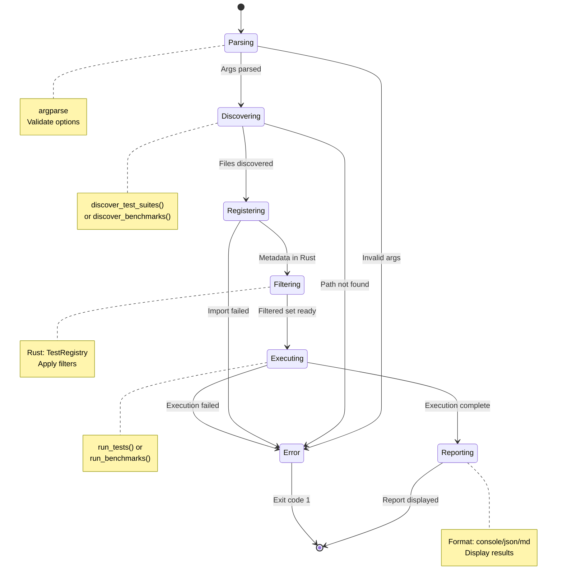

### State Transitions & Triggers

#### Test Lifecycle

| From State | Trigger | To State | Action |
|------------|---------|----------|--------|
| Discovered | Filter match | Filtered | Add to filtered set |
| Discovered | Filter mismatch | Skipped | Mark as skipped |
| Filtered | Execution start | Queued | Add to execution queue |
| Queued | Runner picks up | SettingUp | Call setup_suite() |
| SettingUp | Setup succeeds | Ready | Mark ready |
| SettingUp | Setup fails | Failed | Record error |
| Ready | Test starts | Running | Execute test function |
| Running | All assertions pass | Passed | Record success |
| Running | Assertion fails | Failed | Record failure |
| Running | Exception raised | Error | Record error |
| Running | Timeout | Error | Record timeout |
| Passed/Failed/Error | Cleanup needed | TearingDown | Call teardown_suite() |
| TearingDown | Teardown succeeds | Completed | Finalize |
| TearingDown | Teardown fails | Error | Record teardown error |

#### Benchmark Lifecycle

| From State | Trigger | To State | Action |
|------------|---------|----------|--------|
| Discovered | Filter match | Filtered | Add to filtered set |
| Discovered | Filter mismatch | Skipped | Mark as skipped |
| Filtered | Execution start | Queued | Add to execution queue |
| Queued | Runner picks up | Calibrating | Determine iterations |
| Calibrating | Iterations found | WarmingUp | Run warmup rounds |
| Calibrating | Calibration fails | Failed | Record error |
| WarmingUp | Warmup done | Running | Run timed rounds |
| WarmingUp | Warmup fails | Failed | Record error |
| Running | All rounds done | Analyzing | Calculate statistics |
| Running | Round fails | Failed | Record error |
| Analyzing | Stats computed | Completed | Finalize results |

### State Data Structures (Rust)

```rust
/// Overall execution state
#[derive(Debug, Clone, PartialEq, Eq)]
pub enum ExecutionState {
    Idle,
    Discovering,
    Filtering,
    Executing,
    Reporting,
    Completed,
    Failed(String),
}

/// Test lifecycle state
#[derive(Debug, Clone, PartialEq, Eq)]
pub enum TestLifecycleState {
    Discovered,
    Filtered,
    Queued,
    SettingUp,
    Ready,
    Running,
    TearingDown,
    Completed(TestStatus),  // Passed/Failed/Error/Skipped
}

/// Benchmark lifecycle state
#[derive(Debug, Clone, PartialEq, Eq)]
pub enum BenchmarkLifecycleState {
    Discovered,
    Filtered,
    Queued,
    Calibrating,
    WarmingUp,
    Running { current_round: usize, total_rounds: usize },
    Analyzing,
    Completed,
    Failed(String),
}

/// Test status (final outcome) - EXISTING
#[derive(Debug, Clone, Copy, PartialEq, Eq)]
pub enum TestStatus {
    Passed,
    Failed,
    Skipped,
    Error,
}
```

### State Persistence

**In-Memory Only:**
- States are tracked during execution
- No persistence to disk
- State machine resets on each CLI invocation

**State Tracking:**
```rust
pub struct TestExecution {
    meta: TestMeta,
    state: TestLifecycleState,
    started_at: Option<Instant>,
    completed_at: Option<Instant>,
    result: Option<TestResult>,
}

pub struct BenchmarkExecution {
    meta: BenchmarkMeta,
    state: BenchmarkLifecycleState,
    calibration_iterations: Option<usize>,
    warmup_results: Vec<Duration>,
    round_results: Vec<Duration>,
    stats: Option<BenchmarkStats>,
}
```

## Key Design Patterns

### 1. Hybrid Discovery Pattern
```
Python (glob + importlib) → Rust (registry + filtering)
```
- Leverages Python's file system and dynamic loading
- Leverages Rust's performance for filtering and execution

### 2. Registry Pattern
```
TestRegistry/BenchmarkRegistry
  ├─ register(info)
  ├─ get_all()
  ├─ filter_by_pattern()
  └─ filter_by_tags()
```
- Centralized metadata storage
- Efficient filtering before execution

### 3. PyO3 Wrapper Pattern
```rust
#[pyclass(name = "TestRegistry")]
pub struct PyTestRegistry {
    inner: Arc<Mutex<TestRegistry>>,
}

#[pymethods]
impl PyTestRegistry {
    fn register_suite(&self, suite: PyTestSuiteInfo) {
        // Delegate to Rust
    }
}
```
- Thin Python wrapper over Rust types
- Thread-safe with Arc<Mutex<>>

## Performance Characteristics

| Operation | Target | Implementation |
|-----------|--------|----------------|
| Discovery | <200ms for 100 files | Python glob + importlib |
| Filtering | <10ms for 1000 tests | Rust registry operations |
| Execution | Variable | Rust runner with Python callbacks |
| Reporting | <50ms | Rust reporter with formatting |
| CLI Startup | <500ms cold | Python argparse |

## Integration Points

### With Existing Systems

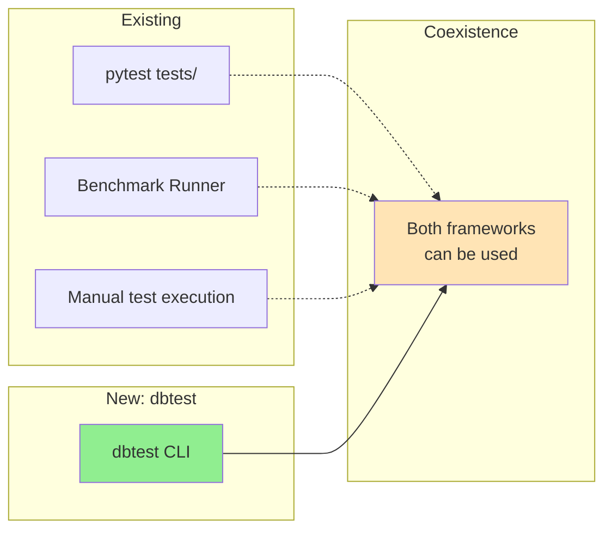

- `dbtest` is **standalone** - does not interfere with pytest
- Existing benchmark discovery pattern is **reused**
- Can run both pytest and dbtest in same project

### With justfile

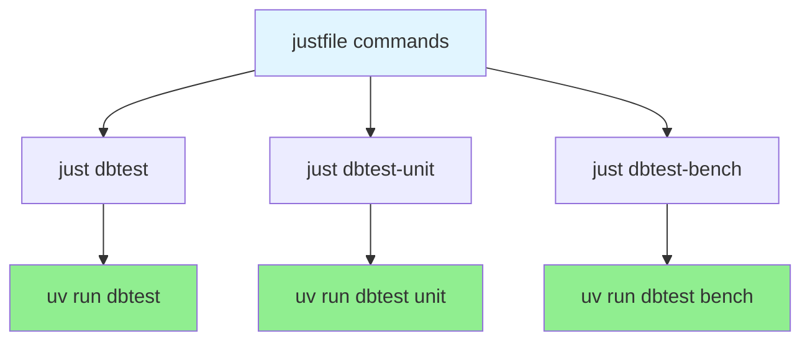

## Future Extensions

### Phase 2 Features (Not in Current Plan)

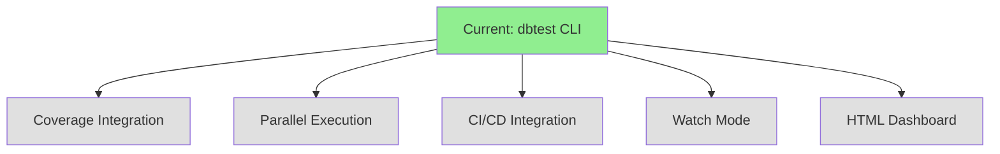

These are potential future enhancements, not included in the current implementation plan.

## References

- **Rust Crate**: `crates/data-bridge-test/`
- **Python Module**: `python/data_bridge/test/`
- **PyO3 Bindings**: `crates/data-bridge/src/test.rs`
- **Existing Benchmark Discovery**: `python/data_bridge/test/benchmark.py:449-563`
- **Implementation Plan**: `/Users/chris.cheng/.claude/plans/enumerated-foraging-lighthouse.md`
