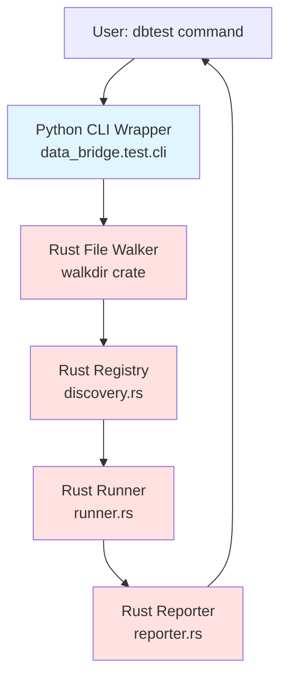
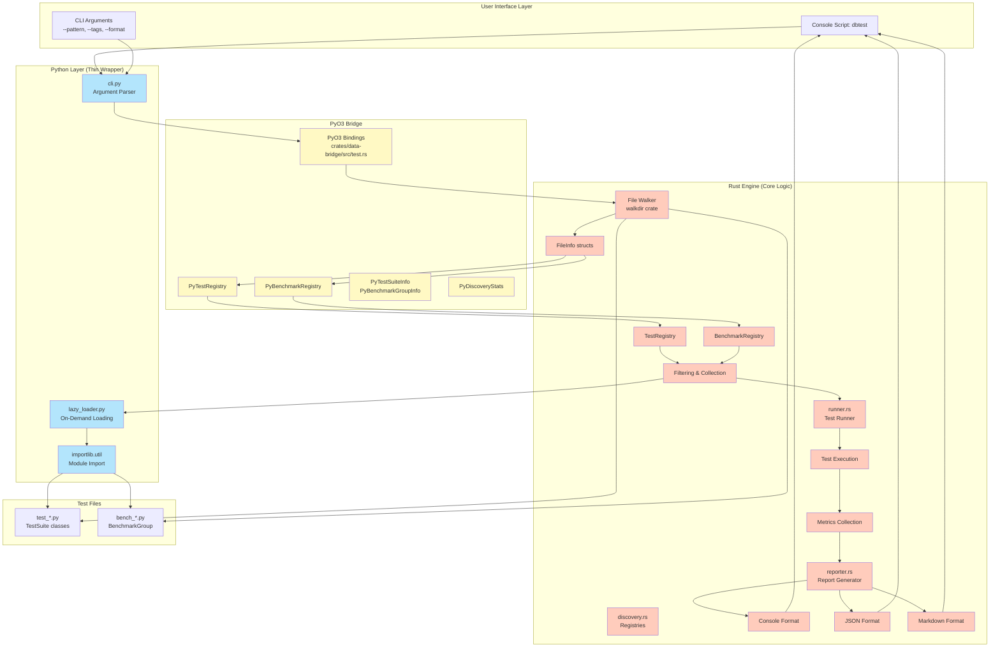

# System Architecture

> Part of [dbtest Architecture Documentation](./README.md)

## High-Level Architecture

**Architecture Principles**:
- **Rust-First Discovery**: File walking in Rust using walkdir crate (~2ms for 100 files)
- **Lazy Loading**: Python modules loaded on-demand during execution
- **Performance**: Minimal Python overhead, most work in Rust
- **Simplicity**: Thin Python CLI wrapper over Rust engine

## Detailed Component Architecture

## Layer Responsibilities

### Python Layer (Thin Wrapper)
- **cli.py**: CLI argument parsing, command routing
- **lazy_loader.py**: On-demand module loading (called by Rust)
- Minimal logic, delegates to Rust engine

### PyO3 Bridge Layer
- **test.rs**: Python bindings for Rust types
- Wraps Rust registries, stats, and metadata
- Handles Python ↔ Rust conversions
- Thread-safe with Arc<Mutex<>>

### Rust Engine Layer
- **File Walker**: Fast file discovery using walkdir crate
- **discovery.rs**: Registries, filtering, metadata storage
- **runner.rs**: Test/benchmark execution
- **reporter.rs**: Report generation and formatting
- **Performance-critical operations**: All in Rust

## Performance Targets

| Operation | Target | Implementation |
|-----------|--------|----------------|
| Discovery | <3ms for 100 files | Rust walkdir |
| Module Loading | On-demand only | Python importlib (lazy) |
| Filtering | <10ms for 1000 tests | Rust registry operations |
| Execution | Variable | Rust runner with Python callbacks |
| Reporting | <50ms | Rust reporter with formatting |
| CLI Startup | <500ms cold | Python argparse |

## Key Architectural Decisions

### 1. Rust-First Discovery (NEW)
**Decision**: Use Rust walkdir crate for file discovery, not Python glob
- **Rationale**: 10-50x faster (~2ms vs 50-100ms for 100 files)
- **Trade-off**: More complex than pure Python, but worth the performance gain

### 2. Lazy Module Loading (NEW)
**Decision**: Only load Python modules that will be executed
- **Rationale**: Don't pay import cost for filtered-out tests
- **Implementation**: Rust calls back to Python lazy_loader when needed

### 3. Console Script, Not Rust Binary
**Decision**: Python CLI wrapper, not standalone Rust binary
- **Rationale**: Easier install (pip/uv), works with venv, simpler distribution
- **Trade-off**: Python startup overhead (~200-300ms) vs Rust binary

### 4. Standalone, Not pytest Plugin
**Decision**: Independent tool, doesn't integrate with pytest
- **Rationale**: User requirement, simpler implementation, full control
- **Coexistence**: Can run both pytest and dbtest in same project

### 5. No Registry Cache
**Decision**: Discover fresh on each run, no persistent cache
- **Rationale**: Fast enough (<3ms), simpler, no stale cache issues
- **Trade-off**: Repeat work vs cache invalidation complexity

## See Also

- [State Machines](./state-machines.md) - Lifecycle state machines
- [Data Flows](./data-flows.md) - Sequence diagrams
- [Components](./components.md) - Detailed component responsibilities
- [Implementation](./implementation.md) - File structure and patterns
