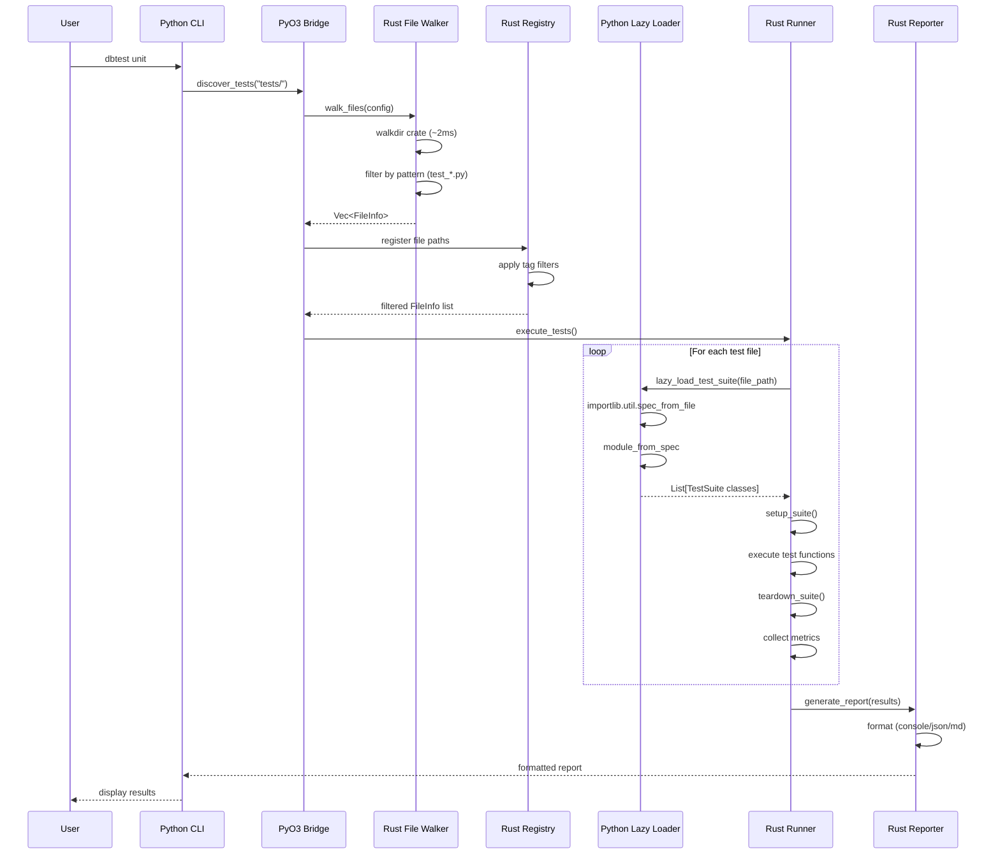
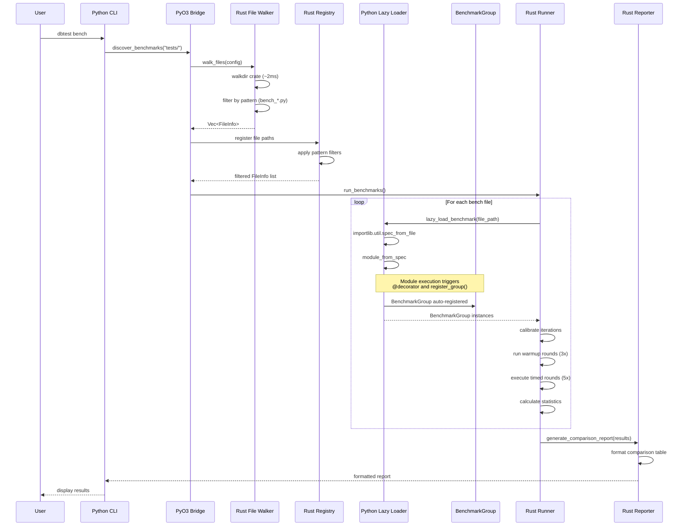
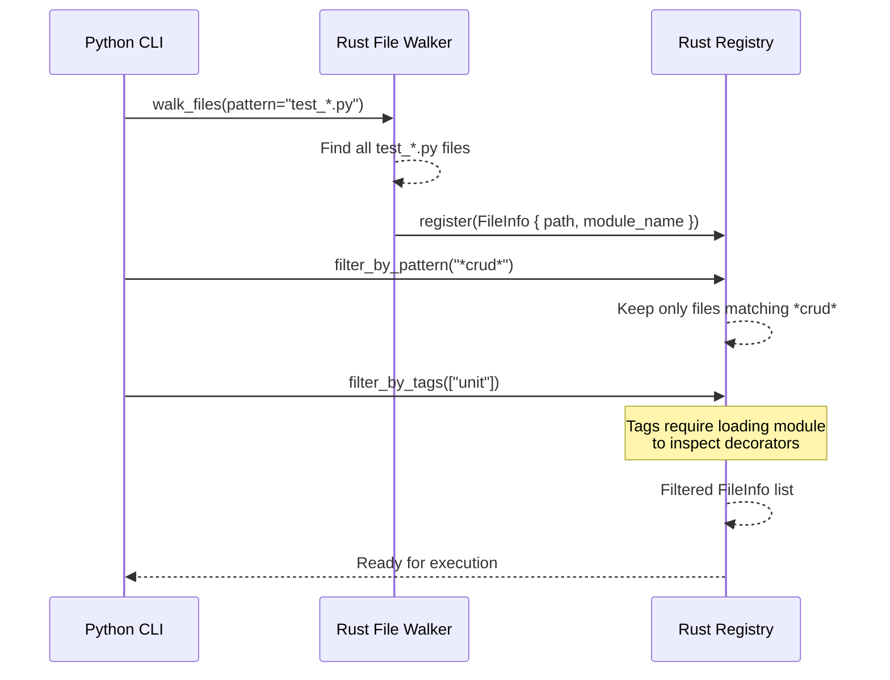
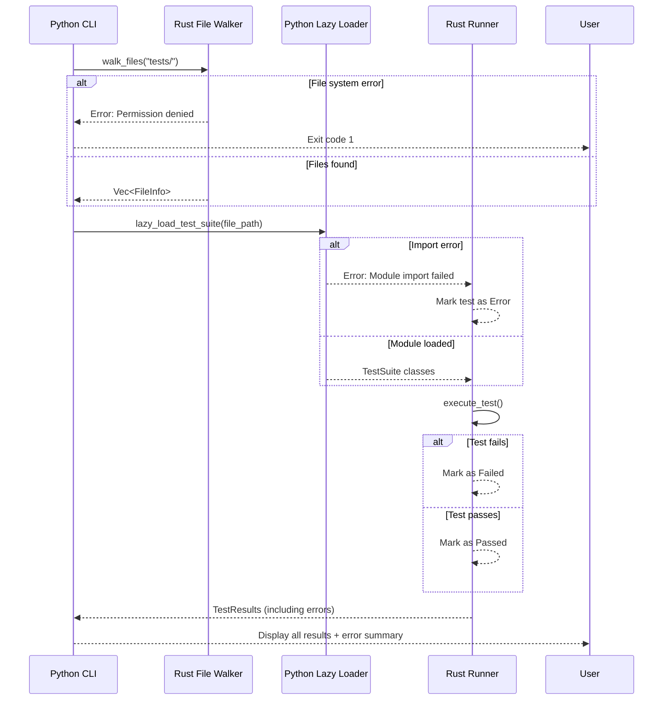

# Data Flows

> Part of [dbtest Architecture Documentation](./README.md)

This document shows the sequence of operations and data flow through the dbtest system for different execution paths.

## Test Discovery & Execution Flow



**Key Points**:
1. **Fast Discovery**: Rust walkdir finds files in ~2ms (not Python glob)
2. **Lazy Loading**: Python modules only loaded when needed for execution
3. **Rust Execution**: Main runner logic in Rust, calls into Python for tests
4. **Single Pass**: No separate discovery and execution phases

## Benchmark Discovery & Execution Flow



**Key Points**:
1. **Same Discovery**: Uses same Rust walkdir approach
2. **Lazy Loading**: Benchmark files loaded on-demand
3. **Auto-Registration**: BenchmarkGroup registers during module import
4. **Statistics**: Mean, median, stddev, percentiles calculated in Rust

## Filtering Flow



**Filtering Strategy**:
- **File Pattern**: Applied during walkdir (fast, no I/O)
- **Name Pattern**: Applied on FileInfo list (fast, string match)
- **Tags**: Requires lazy loading module to inspect decorators (slower)

## Error Handling Flow



**Error Handling Principles**:
- **Fail Fast for Discovery**: File system errors exit immediately
- **Collect Test Errors**: Import/execution errors are collected, not fatal
- **Final Report**: Shows all results including errors
- **Exit Code**: Non-zero if any tests failed or errored

## Performance Optimization Points

### Critical Path (Discovery to Execution)

```
1. CLI startup              ~200-300ms  (Python import overhead)
   ↓
2. walkdir file discovery   ~2-3ms      (Rust walkdir, 100 files)
   ↓
3. Filtering                ~0.1-1ms    (Rust string matching)
   ↓
4. Lazy module loading      ~10-50ms    (Python importlib, per file)
   ↓
5. Test execution          Variable     (User test code)
   ↓
6. Report generation       ~10-50ms     (Rust formatting)
```

**Bottlenecks**:
- **CLI Startup**: Python import overhead (~200-300ms) - unavoidable
- **Module Loading**: Lazy loading mitigates by only loading needed files
- **Test Execution**: Dominated by actual test logic

**Optimizations**:
- ✅ Use Rust walkdir (10-50x faster than Python glob)
- ✅ Lazy loading (don't load filtered-out files)
- ✅ Filtering in Rust (faster than Python)
- ❌ Not caching (complexity not worth <3ms savings)

## See Also

- [Architecture](./architecture.md) - System architecture
- [State Machines](./state-machines.md) - Lifecycle states
- [Components](./components.md) - Component responsibilities
