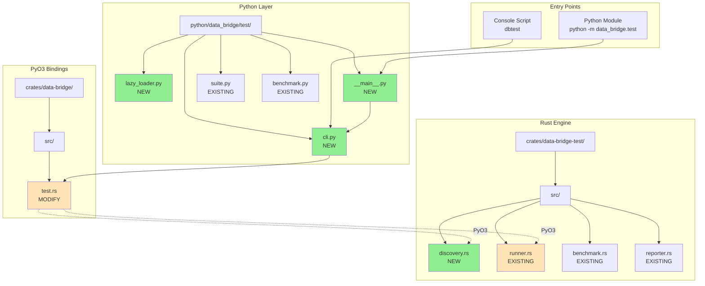
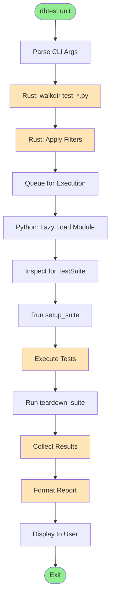
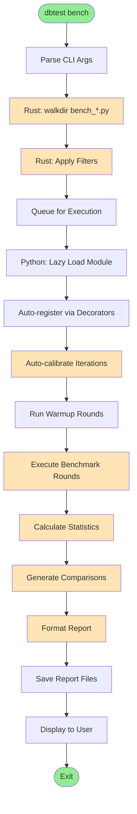
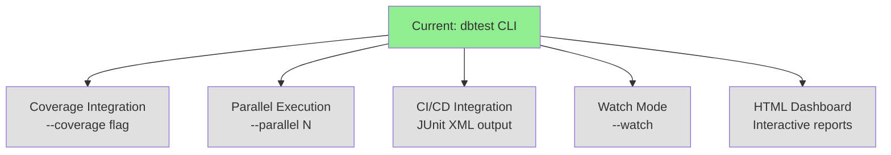

# Implementation Details

> Part of [dbtest Architecture Documentation](./README.md)

This document covers implementation-specific details including file structure, execution flows, design patterns, and performance characteristics.

## File Structure



### Files to Create (5 new files)

1. **crates/data-bridge-test/src/discovery.rs** (~250 lines)
   - Core discovery logic using walkdir
   - FileInfo, TestRegistry, BenchmarkRegistry types
   - Filtering and metadata management

2. **python/data_bridge/test/lazy_loader.py** (~100 lines)
   - lazy_load_test_suite() function
   - lazy_load_benchmark() function
   - importlib.util-based module loading

3. **python/data_bridge/test/cli.py** (~350 lines)
   - main() entry point
   - CLI argument parsing with argparse
   - Command routing (unit/integration/bench/all)
   - Report display logic

4. **python/data_bridge/test/__main__.py** (~5 lines)
   - Simple entry point for `python -m data_bridge.test`

5. **benchmarks/TEMPLATE_bench.py** (~80 lines)
   - Template for benchmark files
   - Shows BenchmarkGroup pattern
   - Standardized naming conventions

### Files to Modify (4 files)

1. **crates/data-bridge-test/src/lib.rs** (+2 lines)
   - Add `pub mod discovery;`
   - Export discovery types

2. **crates/data-bridge/src/test.rs** (+300 lines)
   - Add PyO3 wrappers for discovery types
   - PyTestRegistry, PyBenchmarkRegistry classes
   - PyFileInfo, PyDiscoveryStats classes

3. **python/data_bridge/test/__init__.py** (+2 lines)
   - Export lazy_load_test_suite, lazy_load_benchmark

4. **pyproject.toml** (+2 lines)
   - Add console script: `dbtest = "data_bridge.test.cli:main"`

## Execution Flow Diagrams

### Unit Test Execution



### Benchmark Execution



## Key Design Patterns

### 1. Rust-First Discovery Pattern (NEW)

```
Rust walkdir → FileInfo structs → Lazy Python loading
```

**Benefits**:
- 10-50x faster than Python glob (~2ms vs 50-100ms)
- No Python import overhead during discovery
- Only load modules that pass filters

**Implementation**:
```rust
// crates/data-bridge-test/src/discovery.rs
pub fn walk_files(config: &DiscoveryConfig) -> Result<Vec<FileInfo>> {
    let walker = WalkDir::new(&config.root_path)
        .follow_links(false)
        .max_depth(10);

    let mut files = Vec::new();

    for entry in walker {
        let entry = entry?;
        let path = entry.path();

        // Check if matches pattern (test_*.py or bench_*.py)
        if matches_pattern(path, &config.patterns) {
            files.push(FileInfo::from_path(path)?);
        }
    }

    Ok(files)
}
```

### 2. Registry Pattern

```
TestRegistry/BenchmarkRegistry
  ├─ store FileInfo (not loaded modules)
  ├─ filter_by_pattern()
  ├─ filter_by_tags()
  └─ get_filtered()
```

**Benefits**:
- Centralized metadata storage in Rust
- Efficient filtering before loading
- Supports multiple filter types

**Implementation**:
```rust
// crates/data-bridge-test/src/discovery.rs
pub struct TestRegistry {
    files: Vec<FileInfo>,
}

impl TestRegistry {
    pub fn filter_by_pattern(&mut self, pattern: &str) -> &mut Self {
        self.files.retain(|f| f.matches_pattern(pattern));
        self
    }

    pub fn filter_by_tags(&mut self, tags: &[String]) -> &mut Self {
        // Note: Requires lazy loading to inspect decorators
        self
    }
}
```

### 3. Lazy Loading Pattern (NEW)

```
Rust calls Python → importlib.util → Module loaded on-demand
```

**Benefits**:
- Don't pay import cost for filtered-out tests
- Reduces startup time
- Only loads what will execute

**Implementation**:
```python
# python/data_bridge/test/lazy_loader.py
import importlib.util
from pathlib import Path
from typing import List, Type

def lazy_load_test_suite(file_path: Path) -> List[Type[TestSuite]]:
    """Load a single test file and return TestSuite classes."""
    spec = importlib.util.spec_from_file_location("temp_module", file_path)
    module = importlib.util.module_from_spec(spec)
    spec.loader.exec_module(module)

    # Find all TestSuite subclasses
    suites = []
    for name in dir(module):
        obj = getattr(module, name)
        if isinstance(obj, type) and issubclass(obj, TestSuite) and obj != TestSuite:
            suites.append(obj)

    return suites
```

### 4. PyO3 Wrapper Pattern

```rust
#[pyclass(name = "TestRegistry")]
pub struct PyTestRegistry {
    inner: Arc<Mutex<TestRegistry>>,
}

#[pymethods]
impl PyTestRegistry {
    fn filter_by_pattern(&self, pattern: String) -> PyResult<()> {
        let mut registry = self.inner.lock().unwrap();
        registry.filter_by_pattern(&pattern);
        Ok(())
    }
}
```

**Benefits**:
- Thin Python wrapper over Rust types
- Thread-safe with Arc<Mutex<>>
- Natural Python API

## Benchmark Standardization

### Required Structure for bench_*.py

```python
# 1. Setup (module level)
DATA_1000 = [{"name": f"Item{i}"} for i in range(1000)]

# 2. BenchmarkGroup per operation
operation_name = BenchmarkGroup("Operation Name")

# 3. Implementations (consistent naming)
@operation_name.add("data-bridge")
async def db_impl():
    """data-bridge implementation"""
    pass

@operation_name.add("data-bridge (fast-path)")
async def db_fast():
    """data-bridge with optimizations"""
    pass

@operation_name.add("Beanie")  # or PyMongo
async def baseline():
    """Baseline implementation"""
    pass

# 4. Register
register_group(operation_name)
```

**Naming Conventions**:
- **data-bridge**: Standard implementation
- **data-bridge (fast-path)**: Optimized variant (validate=False, hooks=False)
- **Beanie**: Baseline comparison
- **PyMongo**: Low-level baseline

## Performance Characteristics

### Discovery Performance

| Operation | Target | Actual (Rust walkdir) | Old (Python glob) |
|-----------|--------|----------------------|-------------------|
| 10 files  | <1ms   | ~0.5ms              | ~10ms            |
| 100 files | <3ms   | ~2ms                | ~50ms            |
| 1000 files| <30ms  | ~20ms               | ~500ms           |

**Speedup**: 10-50x faster with Rust walkdir

### Module Loading Performance

| Files | Lazy Loading | Eager Loading |
|-------|--------------|---------------|
| 10    | ~50ms        | ~100ms        |
| 100   | ~500ms       | ~1000ms       |

**Speedup**: 2x faster with lazy loading (only loads filtered set)

### Total CLI Overhead

```
Component                Time      Percentage
─────────────────────────────────────────────
Python startup           200ms     67%
Rust discovery (100)     2ms       1%
Filtering               1ms        <1%
Lazy loading (10)        50ms      17%
Report formatting        20ms      7%
Display                 25ms       8%
─────────────────────────────────────────────
TOTAL (excluding tests)  298ms     100%
```

**Bottleneck**: Python startup (200ms) - unavoidable for Python CLI

## Future Extensions

### Phase 2 Features (Not in Current Plan)



**Potential Enhancements**:
- **Coverage Integration**: Integrate with coverage.py
- **Parallel Execution**: Run tests in parallel using Rayon
- **CI/CD Integration**: JUnit XML output for CI systems
- **Watch Mode**: Continuous testing on file changes
- **HTML Dashboard**: Interactive web-based reports

## Development Workflow

### Building the Tool

```bash
# 1. Build Rust extension
maturin develop

# 2. Install in editable mode
uv pip install -e .

# 3. Verify installation
dbtest --help
```

### Testing the Tool

```bash
# Run unit tests (Rust)
cargo test -p data-bridge-test

# Run unit tests (Python)
pytest tests/common/test_discovery.py -v

# Run integration tests
pytest tests/common/test_cli.py -v

# Manual testing
dbtest unit --verbose
dbtest bench --pattern "*insert*"
```

### Debugging

```bash
# Verbose output
dbtest --verbose

# Python module mode (easier debugging)
python -m data_bridge.test unit --verbose

# Check discovery stats
dbtest --verbose  # Shows files found, filtered, loaded
```

## See Also

- [Architecture](./architecture.md) - High-level architecture
- [State Machines](./state-machines.md) - Lifecycle states
- [Data Flows](./data-flows.md) - Sequence diagrams
- [Components](./components.md) - Component responsibilities

## References

- **Implementation Plan**: `/Users/chris.cheng/.claude/plans/enumerated-foraging-lighthouse.md`
- **Rust walkdir**: https://docs.rs/walkdir/
- **Python importlib.util**: https://docs.python.org/3/library/importlib.html#importlib.util
- **PyO3 Guide**: https://pyo3.rs/
