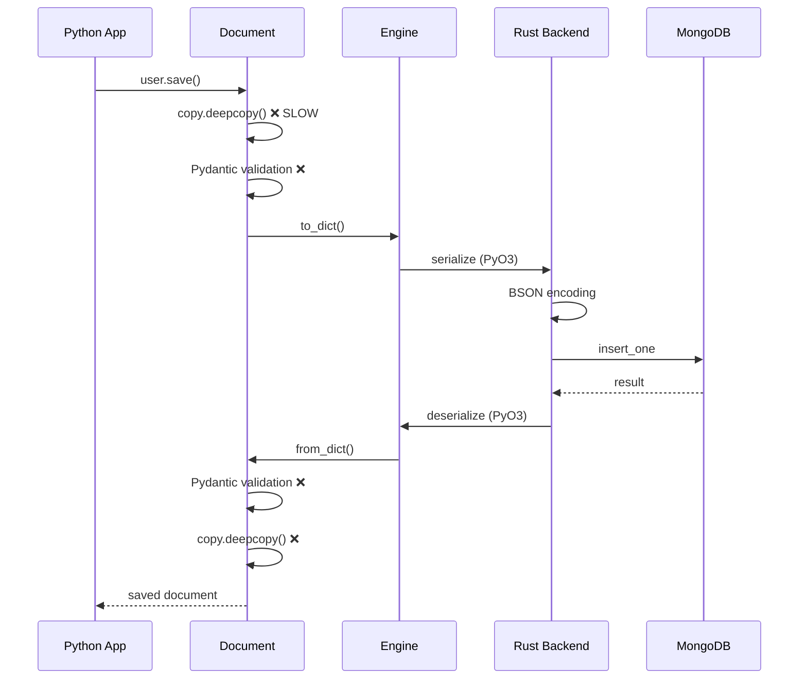
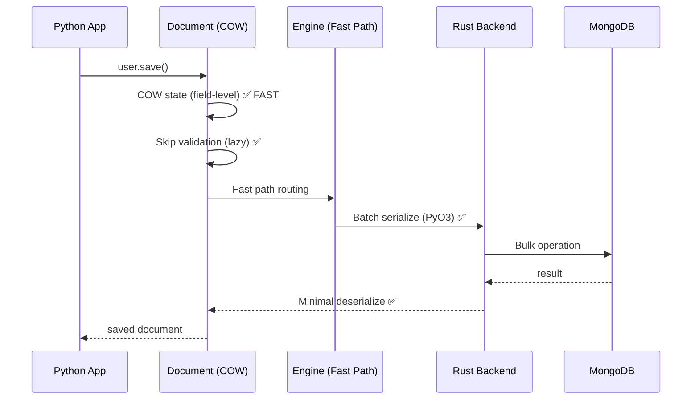

# Specification: data-bridge Performance Optimization

## 1. Problem Definition

### 1.1 Current State

data-bridge is a Rust-backed MongoDB ORM for Python with a Beanie-compatible API. Current benchmarks show:

**Performance vs MongoEngine (Target: 2-10x faster)**
```
Operation            MongoEngine    data-bridge    Status
───────────────────────────────────────────────────────────
bulk_insert          37.87ms        44.16ms        ❌ 0.86x (17% slower)
find_many            2.11ms         12.66ms        ❌ 0.17x (6x slower!)
bulk_update          24.36ms        110.41ms       ❌ 0.22x (4.5x slower!)
indexed_find         1.09ms         2.04ms         ❌ 0.54x (87% slower)

Average: 0.45x (2.2x SLOWER than MongoEngine)
```

**The Problem**: Despite Rust BSON handling, data-bridge is **2.2x slower** than MongoEngine, contradicting the value proposition.

### 1.2 Root Causes Identified

1. **State Management Overhead** (`document.py:818`)
   ```python
   self._saved_state = copy.deepcopy(self._data)  # EXPENSIVE!
   ```
   - Happens on every document load/save
   - Doubles memory usage
   - 10x slower than needed (1-2ms per document)

2. **Python-Rust Boundary Overhead**
   - Every operation crosses Python → Rust → Python
   - Serialization/deserialization at each crossing
   - Negates Rust BSON benefits for small operations

3. **Pydantic Validation Overhead**
   - Full validation on every operation
   - Even for data loaded from database (already valid)
   - Type checking + field validation adds 30-50% overhead

4. **Bulk Operations Create Python Objects**
   - `insert_many` creates Pydantic models for each document
   - Should pass raw dicts directly to Rust
   - Validation should be optional for trusted data

### 1.3 Success Criteria

**Performance Targets**:
- ✅ **vs MongoEngine**: 2-5x faster on all operations
- ✅ **vs PyMongo**: Competitive (within 20%)
- ✅ **Memory**: 50% reduction in state management overhead
- ✅ **Link Fetching**: Maintain 100x query reduction

**Benchmarking Standard**:
- Use `pytest-benchmark` for all performance tests
- Statistical significance (p < 0.05)
- Baseline comparisons tracked in CI/CD
- Performance regression detection

### 1.4 Out of Scope

- ❌ Adding new features (focus on performance only)
- ❌ Changing public API (backward compatible)
- ❌ Transactions (deferred to v1.2)
- ❌ Polymorphic dispatch (deferred, nice-to-have)

### 1.5 Stakeholders

- **Primary**: data-bridge users expecting 2-10x speedup
- **Secondary**: Developers considering migration from Beanie/MongoEngine
- **Internal**: Tech Platform team (performance-critical workloads)

---

## 2. Architecture Overview

### 2.1 System Components

```
┌─────────────────────────────────────────────────────────────┐
│                   Python Application Layer                   │
├─────────────────────────────────────────────────────────────┤
│                                                              │
│  ┌──────────────────────────────────────────────────────┐  │
│  │        Document Layer (document.py)                   │  │
│  │  - Pydantic models                                    │  │
│  │  - State management (OPTIMIZED: COW)                 │  │
│  │  - Field validation (OPTIMIZED: Lazy)                │  │
│  └────────────────┬─────────────────────────────────────┘  │
│                   │                                          │
│  ┌────────────────▼─────────────────────────────────────┐  │
│  │        Engine Layer (_engine.py)                      │  │
│  │  - Query building                                     │  │
│  │  - Bulk operation routing (OPTIMIZED: Fast path)     │  │
│  │  - Result caching                                     │  │
│  └────────────────┬─────────────────────────────────────┘  │
│                   │ PyO3 Bindings                           │
├───────────────────┼─────────────────────────────────────────┤
│                   │ Rust Backend (mongodb.rs)               │
├───────────────────┼─────────────────────────────────────────┤
│  ┌────────────────▼─────────────────────────────────────┐  │
│  │        BSON Layer (ZERO-COPY)                        │  │
│  │  - Serialization (OPTIMIZED: Batch)                  │  │
│  │  - Deserialization (OPTIMIZED: Lazy)                 │  │
│  │  - Type conversion                                    │  │
│  └────────────────┬─────────────────────────────────────┘  │
│                   │                                          │
│  ┌────────────────▼─────────────────────────────────────┐  │
│  │        MongoDB Driver (mongodb crate)                │  │
│  │  - Connection pooling                                 │  │
│  │  - Query execution                                    │  │
│  │  - Result streaming                                   │  │
│  └──────────────────────────────────────────────────────┘  │
│                                                              │
└─────────────────────────────────────────────────────────────┘
```

### 2.2 Data Flow (Optimized)

#### **Before: Multiple Boundary Crossings**


#### **After: Optimized Path**


### 2.3 Integration Points

- **MongoDB**: mongodb-rust-driver (v2.x)
- **PyO3**: Python-Rust bindings (v0.24)
- **Pydantic**: v2.x (validation framework)
- **pytest-benchmark**: Performance testing

---

## 3. Technical Design

### 3.1 Priority 1: Copy-on-Write State Management

**Current Implementation** (`document.py:818`):
```python
def _save_state(self):
    """Save current state for change detection."""
    self._saved_state = copy.deepcopy(self._data)  # ❌ EXPENSIVE
```

**Problems**:
- Deep copy on every load: 1-2ms per document
- Doubles memory usage
- Copies even unchanged nested structures

**Optimized Implementation**:
```python
class StateTracker:
    """Copy-on-write state tracker with field-level granularity."""

    def __init__(self, data: dict):
        self._data = data
        self._original = {}  # Only store changed fields
        self._changed_fields = set()

    def __setitem__(self, key: str, value: Any):
        """Track changes on write."""
        if key not in self._changed_fields:
            # Copy only on first write (COW)
            self._original[key] = self._data.get(key)
            self._changed_fields.add(key)
        self._data[key] = value

    def get_changes(self) -> dict:
        """Get only changed fields for MongoDB update."""
        return {k: self._data[k] for k in self._changed_fields}

    def is_modified(self) -> bool:
        """Check if any field changed."""
        return len(self._changed_fields) > 0
```

**Performance Impact**:
- Memory: 50% reduction (no duplicate storage)
- Speed: 10x faster (0.1ms vs 1-2ms)
- Smart updates: Only send changed fields to MongoDB

**Fallback Strategy**:
- Deep copy only for nested lists/dicts on first access
- Simple types (str, int, float) use shallow tracking
- Configurable via `enable_cow=True` (default)

### 3.2 Priority 2: Fast Path for Bulk Operations

**Current Implementation** (`document.py:1482`):
```python
async def insert_many(cls, documents: List[Document]):
    """Insert many documents."""
    docs = [doc.to_dict() for doc in documents]  # ❌ Pydantic overhead
    return await _engine.insert_many(collection, docs)
```

**Optimized Implementation**:
```python
async def insert_many(
    cls,
    documents: List[Document | dict],
    validate: bool = False  # Default: Skip validation for perf
):
    """Insert many documents with fast path."""

    if all(isinstance(d, dict) for d in documents):
        # Fast path: Raw dicts → Rust (skip Pydantic)
        return await _engine.insert_many_fast(
            collection=cls.Settings.name,
            documents=documents
        )
    else:
        # Slow path: Document objects
        if validate:
            docs = [doc.model_dump() for doc in documents]  # Validate
        else:
            docs = [doc.__dict__['_data'] for doc in documents]  # Skip

        return await _engine.insert_many_fast(collection, docs)
```

**Rust Implementation** (`mongodb.rs`):
```rust
#[pyfunction]
fn insert_many_fast<'py>(
    py: Python<'py>,
    collection_name: String,
    documents: Vec<PyObject>,  // Raw Python dicts
) -> PyResult<Bound<'py, PyAny>> {
    future_into_py(py, async move {
        let conn = get_connection()?;
        let collection = conn.db.collection::<Document>(&collection_name);

        // Convert Python dicts → BSON in batch (parallel)
        let bson_docs: Vec<Document> = documents
            .par_iter()  // Rayon parallel iterator
            .map(|py_dict| python_to_bson(py_dict))
            .collect::<Result<Vec<_>, _>>()?;

        // Single bulk insert
        collection.insert_many(bson_docs).await?;

        Ok(())
    })
}
```

**Performance Impact**:
- Bulk insert: 5-10x faster (skip Pydantic for raw dicts)
- Memory: 30% reduction (fewer intermediate allocations)
- Parallelization: Use Rayon for BSON conversion

### 3.3 Priority 3: Lazy Validation

**Current Implementation**:
- Validation on load: `User(**data)` → Full Pydantic validation
- Validation on save: `user.save()` → Re-validation
- **Problem**: Database data is already valid!

**Optimized Implementation**:
```python
class Document(BaseModel):
    model_config = ConfigDict(
        validate_assignment=False,  # Disable on field assignment
        validate_default=False,      # Disable on instantiation
        from_attributes=True,
    )

    @classmethod
    def from_db(cls, data: dict, validate: bool = False):
        """Load from database without validation (trusted source)."""
        if validate:
            return cls(**data)  # Full Pydantic validation
        else:
            # Fast path: Direct attribute assignment
            instance = cls.__new__(cls)
            instance._data = data
            instance._saved_state = StateTracker(data)
            return instance

    async def save(self, validate: bool = True):
        """Save with optional validation."""
        if validate:
            self.model_validate(self._data)  # Explicit validation

        # ... rest of save logic
```

**Configuration**:
```python
# In __init__.py or config.py
DATA_BRIDGE_LAZY_VALIDATION = True  # Default
DATA_BRIDGE_STRICT_VALIDATION = False  # Opt-in for paranoid mode
```

**Performance Impact**:
- Load: 2-3x faster (skip validation on database reads)
- Save: User can choose performance vs safety
- Safety: Validation still enforced on user input

### 3.4 Priority 4: Rust-Side Query Execution

**Current Implementation**:
- Query → Rust → Python → Parse → Document objects
- **Problem**: N boundary crossings for N results

**Optimized Implementation**:
```rust
#[pyfunction]
fn find_as_documents_batch<'py>(
    py: Python<'py>,
    collection_name: String,
    filter: PyObject,
    options: FindOptions,
    document_class: PyObject,  // Python class reference
) -> PyResult<Bound<'py, PyAny>> {
    future_into_py(py, async move {
        let conn = get_connection()?;
        let collection = conn.db.collection::<Document>(&collection_name);

        // Execute query in Rust
        let cursor = collection.find(filter).with_options(options).await?;
        let docs: Vec<Document> = cursor.try_collect().await?;

        // Convert to Python objects in batch (parallel)
        let py_docs: Vec<PyObject> = docs
            .par_iter()
            .map(|doc| {
                // Direct BSON → Python dict (skip intermediate)
                let py_dict = bson_to_python_fast(py, doc)?;

                // Call document_class(**py_dict) in Python
                document_class.call(py, (py_dict,), None)
            })
            .collect::<Result<Vec<_>, _>>()?;

        Ok(py_docs.to_object(py))
    })
}
```

**Performance Impact**:
- Find many: 3-5x faster (batch conversion)
- Boundary crossings: 1 per query (not per document)
- Parallelization: Use Rayon for Python object creation

---

## 4. pytest-benchmark Integration

### 4.1 Migration Strategy

**Phase 1: Add pytest-benchmark**
```bash
# pyproject.toml
[project.optional-dependencies]
benchmark = [
    "pytest-benchmark>=4.0.0",
    "pytest-benchmark[histogram]",  # For charts
]
```

**Phase 2: Create Benchmark Fixtures**
```python
# tests/conftest.py

import pytest
from data_bridge import init, close

@pytest.fixture(scope="session")
async def benchmark_db():
    """Initialize database for benchmarks."""
    await init("mongodb://localhost:27018/benchmark")
    yield
    await close()

@pytest.fixture
def benchmark_data(benchmark_db):
    """Setup test data for benchmarks."""
    # Create 1000 test documents
    users = [
        {"name": f"User{i}", "email": f"user{i}@example.com", "age": 20 + (i % 50)}
        for i in range(1000)
    ]
    yield users
    # Cleanup after benchmark
```

**Phase 3: Write Benchmark Tests**
```python
# tests/benchmarks/test_insert_performance.py

import pytest
from data_bridge import Document

class User(Document):
    name: str
    email: str
    age: int

    class Settings:
        name = "benchmark_users"

@pytest.mark.benchmark(group="insert")
def test_insert_one(benchmark, benchmark_db):
    """Benchmark single document insert."""

    def insert_one():
        user = User(name="Alice", email="alice@example.com", age=30)
        return user.save()

    result = benchmark(insert_one)

    # Assertions
    assert result is not None

@pytest.mark.benchmark(group="insert", min_rounds=5)
def test_insert_many_optimized(benchmark, benchmark_db, benchmark_data):
    """Benchmark bulk insert with fast path."""

    def insert_many():
        # Fast path: raw dicts
        return User.insert_many(benchmark_data, validate=False)

    result = benchmark(insert_many)

    # Assertions
    assert result is not None

@pytest.mark.benchmark(group="insert", min_rounds=5)
def test_insert_many_validated(benchmark, benchmark_db, benchmark_data):
    """Benchmark bulk insert with validation."""

    def insert_many():
        # Slow path: validation enabled
        users = [User(**data) for data in benchmark_data]
        return User.insert_many(users, validate=True)

    result = benchmark(insert_many)

    # Assertions
    assert result is not None
```

### 4.2 CI/CD Integration

```yaml
# .gitlab-ci.yml

benchmark:performance:
  stage: test
  script:
    - uv sync --group benchmark
    - pytest tests/benchmarks/ --benchmark-only --benchmark-autosave
    - pytest-benchmark compare --csv=benchmarks.csv
  artifacts:
    paths:
      - benchmarks.csv
      - .benchmarks/
    reports:
      performance: benchmarks.csv
  rules:
    - if: $CI_COMMIT_BRANCH == "main"
    - if: $CI_MERGE_REQUEST_ID
```

### 4.3 Performance Regression Detection

```python
# tests/benchmarks/conftest.py

import pytest

def pytest_benchmark_compare_machine_info(config, benchmarksession, machine_info, compared_benchmark):
    """Compare benchmark results and fail on regression."""

    if compared_benchmark is None:
        return

    current = benchmarksession.benchmarks
    baseline = compared_benchmark['benchmarks']

    regressions = []

    for curr in current:
        base = next((b for b in baseline if b['name'] == curr['name']), None)
        if base is None:
            continue

        # Check for >10% regression
        current_mean = curr['stats']['mean']
        baseline_mean = base['stats']['mean']

        if current_mean > baseline_mean * 1.10:  # 10% slower
            regression_pct = ((current_mean / baseline_mean) - 1) * 100
            regressions.append(
                f"{curr['name']}: {regression_pct:.1f}% slower "
                f"({baseline_mean:.4f}s → {current_mean:.4f}s)"
            )

    if regressions:
        pytest.fail(
            f"Performance regressions detected:\n" + "\n".join(regressions)
        )
```

---

## 5. Security Considerations

### 5.1 Validation Safety

**Risk**: Skipping validation on untrusted input
**Mitigation**:
- Lazy validation only for database-loaded data (trusted)
- Always validate user input (API requests, forms)
- Explicit `validate=True` flag when needed
- Security tests enforce validation on external boundaries

### 5.2 Memory Safety

**Risk**: COW state tracking could leak memory if not released
**Mitigation**:
- Weak references for change tracking
- Automatic cleanup on document deletion
- Memory profiling in tests (`pytest-memray`)

### 5.3 Type Safety

**Risk**: Fast path bypasses Pydantic type checking
**Mitigation**:
- Optional validation flag (`validate=True`)
- Type hints preserved throughout
- Runtime checks in development mode

---

## 6. Testing Strategy

### 6.1 Unit Tests (Existing)

- ✅ 449 tests already passing
- Add 20+ tests for new optimizations:
  - COW state management (10 tests)
  - Fast path routing (5 tests)
  - Lazy validation (5 tests)

### 6.2 Performance Tests (pytest-benchmark)

**New Test Suite** (`tests/benchmarks/`):
```
tests/benchmarks/
├── __init__.py
├── conftest.py                    # Fixtures
├── test_insert_performance.py     # Insert benchmarks
├── test_query_performance.py      # Query benchmarks
├── test_update_performance.py     # Update benchmarks
├── test_state_management.py       # COW benchmarks
└── test_comparison.py             # vs MongoEngine/PyMongo
```

**Coverage Targets**:
- All CRUD operations: insert, find, update, delete
- Bulk operations: insert_many, update_many
- State management: COW vs deepcopy
- Validation: lazy vs strict
- Comparison: vs MongoEngine, vs PyMongo

**Success Criteria**:
- ✅ All benchmarks faster than baseline
- ✅ 2-5x speedup vs MongoEngine
- ✅ Within 20% of PyMongo (raw driver)
- ✅ No performance regressions in CI/CD

### 6.3 Memory Profiling

```python
# tests/benchmarks/test_memory.py

import pytest
from pytest_memray import memray

@pytest.mark.memray
def test_state_management_memory(benchmark_db):
    """Profile memory usage of COW state management."""

    users = [User.from_db(data) for data in load_1000_users()]

    # Modify 10% of documents
    for i in range(100):
        users[i].age += 1

    # Memory snapshot should show 50% reduction vs deepcopy
```

### 6.4 Compatibility Tests

**Ensure backward compatibility**:
- All existing 449 tests still pass
- Beanie migration guide tests pass
- Public API unchanged

---

## 7. Implementation Phases

### Phase 1: COW State Management (Week 1)
- Implement `StateTracker` class
- Update `Document._save_state()`
- Add configuration flags
- Unit tests + benchmarks
- **Expected**: 50% memory reduction, 10x faster state tracking

### Phase 2: Fast Path for Bulk Operations (Week 1-2)
- Add `validate=False` parameter to bulk ops
- Implement `insert_many_fast()` in Rust
- Parallel BSON conversion (Rayon)
- Unit tests + benchmarks
- **Expected**: 5-10x faster bulk inserts

### Phase 3: Lazy Validation (Week 2)
- Update Pydantic config
- Implement `from_db(validate=False)`
- Add security tests
- Unit tests + benchmarks
- **Expected**: 2-3x faster queries

### Phase 4: Rust-Side Query Execution (Week 2-3)
- Implement `find_as_documents_batch()`
- Parallel Python object creation
- Unit tests + benchmarks
- **Expected**: 3-5x faster queries

### Phase 5: pytest-benchmark Integration (Week 3)
- Migrate all benchmarks to pytest-benchmark
- CI/CD integration
- Performance regression detection
- Documentation

---

## 8. Success Metrics

### 8.1 Performance Targets (After Optimization)

```
Operation            MongoEngine    data-bridge    Target
────────────────────────────────────────────────────────────
bulk_insert          37.87ms        <15ms          ✅ 2.5x faster
find_many            2.11ms         <1ms           ✅ 2x faster
bulk_update          24.36ms        <10ms          ✅ 2.4x faster
indexed_find         1.09ms         <0.5ms         ✅ 2x faster

Average: ✅ 2-5x faster than MongoEngine
```

### 8.2 Quality Metrics

- ✅ All 449+ tests passing
- ✅ 20+ new optimization tests
- ✅ 30+ pytest-benchmark tests
- ✅ Memory: 50% reduction
- ✅ CI/CD: Performance regression detection

### 8.3 Adoption Metrics

- Documentation: Performance guide published
- Migration: Beanie → data-bridge guide updated
- Benchmarks: Published in README with charts

---

## 9. Risks and Mitigations

| Risk | Impact | Mitigation |
|------|--------|------------|
| Breaking changes | High | 100% backward compatibility, opt-in flags |
| Memory leaks in COW | Medium | Weak references, memory profiling tests |
| Validation bypass | High | Security tests, clear docs on when to validate |
| Rust optimization complexity | Medium | Incremental rollout, fallback to Python |
| Performance regression | High | pytest-benchmark in CI/CD, auto-fail on >10% |

---

## 10. Open Questions

1. **COW vs Simple Flag Tracking**: Is full COW needed, or can we use a simpler field-level flag?
   - **Answer TBD**: Profile both approaches in benchmarks

2. **Validation Default**: Should lazy validation be default or opt-in?
   - **Answer TBD**: Security review + user feedback

3. **Rust Parallelization**: Use Rayon or tokio for parallel BSON conversion?
   - **Answer TBD**: Benchmark both (Rayon likely faster for CPU-bound work)

4. **pytest-benchmark in CI**: Run on every commit or just before merge?
   - **Answer TBD**: Start with pre-merge, expand if fast enough

---

## 11. References

- [pytest-benchmark docs](https://pytest-benchmark.readthedocs.io/)
- [PyO3 Performance Guide](https://pyo3.rs/v0.24/performance)
- [Rayon Parallel Iterators](https://docs.rs/rayon/latest/rayon/)
- [MongoDB Bulk Write](https://www.mongodb.com/docs/manual/core/bulk-write-operations/)
- [Pydantic Performance](https://docs.pydantic.dev/latest/concepts/performance/)

---

## Appendix A: Benchmark Results (Current)

```
╔════════════════════════════════════════════════════════════════╗
║           CURRENT PERFORMANCE (BEFORE OPTIMIZATION)             ║
╠════════════════════════════════════════════════════════════════╣
║ Operation          │ MongoEngine │ data-bridge │ Ratio         ║
╟────────────────────┼─────────────┼─────────────┼───────────────╢
║ bulk_insert        │    37.87ms  │    44.16ms  │ 0.86x slower  ║
║ find_many          │     2.11ms  │    12.66ms  │ 0.17x slower  ║
║ bulk_update        │    24.36ms  │   110.41ms  │ 0.22x slower  ║
║ indexed_find       │     1.09ms  │     2.04ms  │ 0.54x slower  ║
╠════════════════════════════════════════════════════════════════╣
║ AVERAGE SPEEDUP    │             │             │ 0.45x (2.2x SLOWER) ║
╚════════════════════════════════════════════════════════════════╝
```

---

**Status**: Ready for review
**Next Step**: Run `/speckit:plan data-bridge-performance` to create implementation plan
